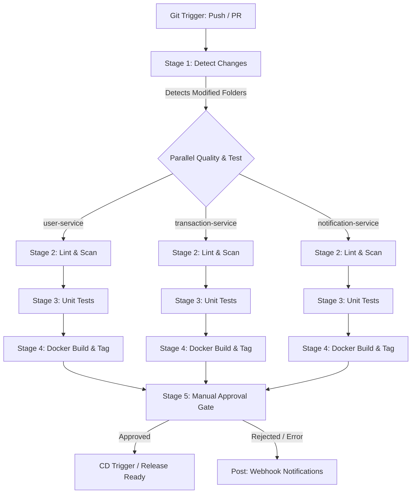

# DevOps Monorepo CI Pipeline & Secrets Management

This project implements a monorepo setup consisting of three microservices (Node.js, Python FastAPI, and Go), an intelligent Jenkins CI pipeline, a secure Git-ignored `/secret` management system backed by AWS S3 remote storage, and local execution logging.

## 📁 Repository Structure

```text
root/
├── user-service/                 # Node.js Express service
│   ├── src/
│   │   ├── index.js              # Server entry point
│   │   └── index.test.js         # Jest HTTP unit tests
│   ├── .eslintrc.json            # ESLint rules
│   ├── package.json              # Service dependencies & scripts
│   └── Dockerfile                # Multi-stage production container
├── transaction-service/          # Python FastAPI service
│   ├── main.py                   # Service entry point
│   ├── test_main.py              # Pytest unit tests
│   ├── requirements.txt          # Python dependencies (flake8, pytest, bandit)
│   └── Dockerfile                # Multi-stage production container
├── notification-service/         # Go service
│   ├── main.go                   # HTTP server implementation
│   ├── main_test.go              # Go handler unit tests
│   ├── go.mod                    # Go module descriptor
│   └── Dockerfile                # Multi-stage minimal production container
├── Jenkinsfile                   # Declarative pipeline with parallel stages
├── shared/
│   ├── ci/                       # Modular CI Shell Scripts
│   │   ├── logger.sh             # Custom logging utility
│   │   ├── detect_changes.sh     # Git diff change detector
│   │   ├── lint.sh               # ESLint / flake8 / go fmt quality checker
│   │   ├── test.sh               # jest / pytest / go test unit tester
│   │   └── scan.sh               # bandit / npm audit / custom secrets scanner
│   └── aws/
│       └── s3_sync.sh            # AWS S3 remote secrets sync tool
├── secret/                       # Local secrets (ignored by Git)
│   └── db_creds.env              # Mock DB credentials file
└── log/                          # Local execution logs (ignored by Git)
    └── logs.txt                  # Output of local CI script runs
```

---

## 🚀 Jenkins CI Pipeline Flow

The declarative `Jenkinsfile` optimizes monorepo builds by only running pipeline stages for modified services.



### Key Pipeline Features:
1. **Parallel execution:** Speeds up build runs by executing linting, testing, and Docker builds concurrently.
2. **Fail-fast:** Instantly fails the pipeline if any linting, unit test, or security scans fail.
3. **Flaky retry:** Auto-retries flaky stages (like Docker build or dependency installs) up to 2 times before failing.
4. **Approval gate:** Halts execution for human approval before CD promotion.

---

## 🔒 Secrets Management via AWS S3

All database credentials, API keys, and sensitive environment configs are stored in `/secret` and synced with AWS S3. **This directory is excluded from Git via `.gitignore` to prevent leaks.**

### S3 Synchronization Script Usage
A utility script `shared/aws/s3_sync.sh` is provided to manage secrets.

1. **Upload local secrets to AWS S3:**
   ```bash
   ./shared/aws/s3_sync.sh upload
   ```
   *Action:* Uploads files in `secret/` to `s3://devops-s3-state-bucket/secrets/`.

2. **Download remote secrets to local workstation:**
   ```bash
   ./shared/aws/s3_sync.sh download
   ```
   *Action:* Syncs remote secrets from your AWS bucket into your local Git-ignored `secret/` folder.

3. **Delete all remote files in the S3 bucket (Cleanup):**
   ```bash
   ./shared/aws/s3_sync.sh clean
   ```
   *Action:* Recursively removes all uploaded files inside `s3://devops-s3-state-bucket` to leave your S3 bucket clean.

---

## 📝 Local Testing & Logging

Local execution outcomes are appended to `log/logs.txt` (which is also ignored by Git).

### Logging Script Usage
The script `shared/ci/logger.sh` is used internally by all scripts and can be used manually:
```bash
./shared/ci/logger.sh <level> <log message>
```
Example:
```bash
./shared/ci/logger.sh INFO "Testing change detector locally"
```

### Local CI Script Validation
You can run the CI stages manually to test before committing:
```bash
# 1. Detect which services changed
./shared/ci/detect_changes.sh HEAD~1

# 2. Run quality linters on changed services
./shared/ci/lint.sh

# 3. Execute unit tests
./shared/ci/test.sh

# 4. Perform security & secrets scanner
./shared/ci/scan.sh
```

---

## 💻 GitHub Setup & Upload Guide

To upload this repository to your private GitHub repository `devops-user/interview5`:

1. **Create the Private Repository on GitHub:**
   Go to GitHub and create a new repository. Set it to **Private** and name it `interview5`. Keep it empty (do not initialize with README, license, or gitignore).

2. **Configure Remote Origin and Push:**
   In your local terminal, run the following commands:
   ```bash
   # Add the GitHub remote origin
   git remote add origin git@github.com:devops-user/interview5.git
   
   # Rename default branch to main (recommended)
   git branch -M main
   
   # Push the codebase to your private main branch
   git push -u origin main
   ```
